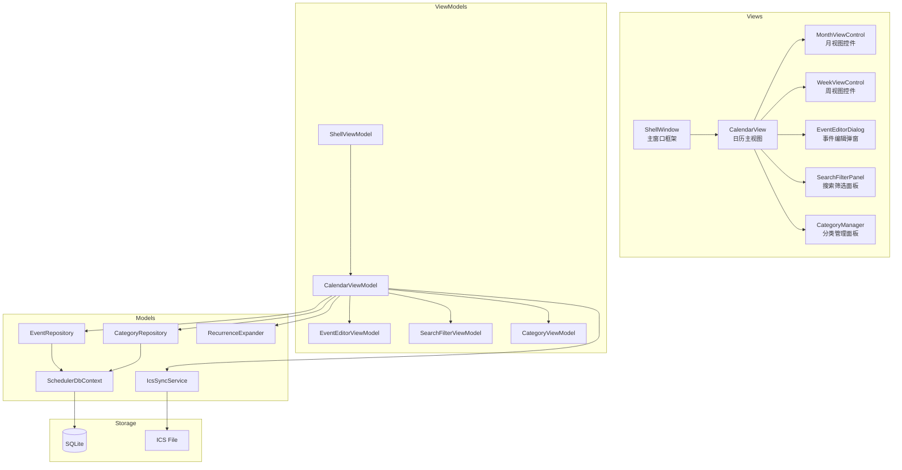

## 产品概述

Scheduler 是一款 Windows 桌面日历待办应用，核心交互围绕一个可视化的日历展开。用户可以在日历上直接查看、创建、编辑待办事件，并自由在月视图（显示整月）与周视图（显示7天时间轴）之间切换。所有数据本地存储在 SQLite 中，同时支持通过 ICS 标准格式导入导出，实现与 Google Calendar、Outlook 等日历服务的云端同步。

## 核心功能

- **双视图日历**：月视图以网格形式展示当月所有日期及事件摘要；周视图以7列时间轴展示每小时的详细安排，用户可一键切换视图，切换时保留当前聚焦的日期
- **事件管理**：点击任意日期/时间格弹出事件编辑窗，支持标题、时间范围、备注等字段；事件以彩色圆点/色条显示在对应日期格内
- **分类与标签**：预设工作、个人、学习等分类，每种分类对应一种颜色标识；用户可自定义新分类，事件按分类着色，便于一眼区分
- **重复事件**：支持设置事件为每天/每周/每月重复，自动在日历上展开显示；修改时允许编辑单次或该系列全部
- **搜索与筛选**：顶部搜索栏输入关键词即时过滤事件列表；支持按分类、日期范围组合筛选
- **云端同步**：支持将事件导出为 ICS 文件，或从 ICS 文件导入合并事件；为后续对接 CalDAV 协议预留扩展接口

## 技术栈

- **运行框架**：.NET 8 (LTS)
- **UI 框架**：WPF (Windows Presentation Foundation)
- **架构模式**：MVVM，使用 CommunityToolkit.Mvvm 简化绑定与消息传递
- **本地数据库**：SQLite，通过 Microsoft.EntityFrameworkCore.Sqlite 访问
- **UI 控件库**：WPF 原生控件 + MaterialDesignInXamlToolkit 增强视觉效果
- **日历 ICS 处理**：Ical.Net 库处理 ICS 文件解析与生成
- **依赖注入**：Microsoft.Extensions.DependencyInjection

## 实现方案

### 整体策略

采用 MVVM 分层架构，将应用拆分为 Model（数据实体与仓储）、ViewModel（业务逻辑与状态管理）、View（XAML 页面与控件）三层。CalendarView 作为主视图，根据用户选择的视图模式动态渲染月视图或周视图控件。数据通过 EF Core DbContext 与 SQLite 交互，ICS 同步模块独立封装以便将来扩展为 CalDAV 客户端。

### 关键技术决策

- **月/周视图切换**：通过 ContentControl 绑定 ViewMode 属性，利用 DataTemplate 选择 CalendarMonthView 或 CalendarWeekView 用户控件，避免重建整个窗口
- **重复事件展开**：存储时仅记录一条事件模板（含重复规则 RRULE），展示时由 RecurrenceExpander 按日期范围动态计算具体实例，不产生冗余存储行
- **搜索性能**：按月分页加载事件，搜索时对内存中已加载的当月数据进行客户端过滤，避免每次搜索都查询数据库
- **ICS 同步**：导出时遍历事件生成 ICS 文件供用户保存；导入时解析 ICS 中的 VEVENT 条目，按标题+时间做去重合并，展示差异预览让用户确认

### 架构设计



### 目录结构

```
Scheduler/
├── Scheduler.App/
│   ├── App.xaml                    # 应用入口，配置 DI 与主题
│   ├── App.xaml.cs
│   ├── Scheduler.App.csproj        # 主项目文件
│   ├── Views/
│   │   ├── ShellWindow.xaml/.cs    # [NEW] 主窗口：标题栏、菜单栏、内容区域容器
│   │   ├── CalendarView.xaml/.cs   # [NEW] 日历主视图：承载月/周视图切换、搜索栏、分类侧栏
│   │   ├── Controls/
│   │   │   ├── MonthViewControl.xaml/.cs  # [NEW] 月视图：7x6网格，每格显示日期号+事件色条
│   │   │   ├── WeekViewControl.xaml/.cs   # [NEW] 周视图：7列×24行时间轴，事件以色块显示
│   │   │   ├── DayCell.xaml/.cs           # [NEW] 日期单元格：日期号、事件颜色点、点击选中
│   │   │   └── EventChip.xaml/.cs         # [NEW] 事件色块：显示标题摘要、拖拽调整时间
│   │   ├── Dialogs/
│   │   │   └── EventEditorDialog.xaml/.cs # [NEW] 事件编辑弹窗：标题、时间、分类、重复规则、备注
│   │   └── Panels/
│   │       ├── SearchFilterPanel.xaml/.cs # [NEW] 搜索筛选面板：关键词输入、分类过滤、日期范围
│   │       ├── CategoryPanel.xaml/.cs     # [NEW] 分类管理面板：分类列表、新增/删除、颜色选择
│   │       └── ImportPreviewDialog.xaml/.cs # [NEW] ICS导入预览：显示差异、确认合并
│   ├── ViewModels/
│   │   ├── ShellViewModel.cs       # [NEW] 管理导航状态、菜单命令
│   │   ├── CalendarViewModel.cs    # [NEW] 核心VM：当前日期、视图模式、事件集合、命令绑定
│   │   ├── EventEditorViewModel.cs # [NEW] 事件编辑逻辑、表单验证、保存/删除命令
│   │   ├── SearchFilterViewModel.cs # [NEW] 搜索文本、分类筛选、过滤后事件列表
│   │   └── CategoryViewModel.cs    # [NEW] 分类CRUD操作
│   ├── Models/
│   │   ├── Entities/
│   │   │   ├── Event.cs            # [NEW] 事件实体：Id, Title, StartTime, EndTime, Description, CategoryId, RecurrenceRule
│   │   │   └── Category.cs         # [NEW] 分类实体：Id, Name, Color, Icon
│   │   ├── SchedulerDbContext.cs   # [NEW] EF Core DbContext：配置实体关系、种子数据
│   │   └── Repositories/
│   │       ├── EventRepository.cs  # [NEW] 事件数据访问：CRUD、按日期范围查询、搜索
│   │       └── CategoryRepository.cs # [NEW] 分类数据访问
│   ├── Services/
│   │   ├── IcsSyncService.cs       # [NEW] ICS导入导出：使用Ical.Net解析生成、去重合并逻辑
│   │   ├── RecurrenceExpander.cs   # [NEW] 重复事件展开器：根据RRULE计算指定范围内的实例日期
│   │   └── CalendarNavigationService.cs # [NEW] 日历导航：上一月/周、下一月/周、今日跳转
│   ├── Converters/
│   │   ├── BoolToVisibilityConverter.cs   # [NEW] 布尔值转可见性
│   │   └── CategoryColorConverter.cs     # [NEW] 分类ID转Brush颜色
│   └── Resources/
│       ├── Styles.xaml             # [NEW] 全局样式定义
│       └── Colors.xaml             # [NEW] 色彩资源：分类默认色板
└── Scheduler.sln                  # [NEW] 解决方案文件
```

### 核心数据结构

```
// 事件实体
public class Event
{
    public int Id { get; set; }
    public string Title { get; set; }
    public DateTime StartTime { get; set; }
    public DateTime EndTime { get; set; }
    public string Description { get; set; }
    public int CategoryId { get; set; }
    public Category Category { get; set; }
    public string RecurrenceRule { get; set; }  // RRULE 格式，如 "FREQ=WEEKLY;BYDAY=MO,WE"
    public bool IsAllDay { get; set; }
    public DateTime CreatedAt { get; set; }
    public DateTime ModifiedAt { get; set; }
}

// 分类实体
public class Category
{
    public int Id { get; set; }
    public string Name { get; set; }
    public string ColorHex { get; set; }  // 如 "#FF6B6B"
    public int SortOrder { get; set; }
}

// 日历视图模式枚举
public enum CalendarViewMode { Month, Week }
```

### 性能与可靠性

- **大型事件集**：月视图仅加载当前月 ± 1月的事件，通过 EF Core 日期范围查询避免全表扫描
- **重复事件**：RecurrenceExpander 在内存中展开，对超过365次重复的规则设上限防止无限循环
- **ICS 导入**：先行解析验证格式，若解析失败回滚不做部分导入；导入前展示变更预览让用户确认
- **线程安全**：所有数据库操作通过 async/await 在后台线程执行，UI 通过 MVVM 数据绑定自动更新，不阻塞主线程

## 设计风格

采用 Windows 11 现代 Fluent Design 风格，强调清透感和层次感。使用丙烯酸材质（Acrylic）背景、圆角卡片、柔和阴影来营造轻盈现代的桌面体验。日历主体为白色/浅灰基底，事件以色块形式呈现，不同分类使用鲜明但和谐的配色区分（如红色=工作、蓝色=个人、绿色=学习）。月视图中事件以紧凑色条显示，周视图中以半透明矩形的色块按时间跨度铺开。整体色调干净明亮，减少视觉噪音，让用户快速聚焦到日期和事件上。

## 页面规划

应用为单窗口多面板结构，不涉及多页面路由，核心交互在一个主窗口中完成。

### 主窗口布局（ShellWindow）

- **顶部标题栏**：左侧显示应用名称 "Scheduler"，右侧为最小化/最大化/关闭按钮，背景使用云母材质，与 Windows 11 窗口风格一致
- **左侧分类面板**：窄侧栏列出所有分类及其颜色圆点，底部有"+"按钮新增分类，点击分类可快速筛选对应事件
- **中央日历区**：占据窗口主体，顶部工具栏包含「今日」按钮、月/周视图切换 Toggle、日期导航箭头、搜索输入框；下方为主日历画布，动态渲染月视图或周视图
- **底部状态栏**：显示当前选中日期的事件数量、同步状态指示

### 月视图控件（MonthViewControl）

- 7列（周日-周六）× 5或6行的网格布局，每格代表一天
- 格内顶部显示日期数字（当月日期黑色、非当月灰色），下方以最多3个彩色圆点代表该日事件
- 点击日期格高亮选中，左侧事件列表区域同步显示该日事件详情
- 双指缩放或滚轮可切换月视图范围

### 周视图控件（WeekViewControl）

- 左侧时间轴列（00:00-23:00），右侧7列对应一周每天
- 事件以带分类颜色的圆角矩形状色块覆盖对应时间段，色块内显示标题
- 支持拖拽事件边缘调整时间范围、拖拽整个色块移动到其他时段
- 当前时间显示一条红色指示线

### 事件编辑弹窗（EventEditorDialog）

- 居中模态弹窗，圆角阴影卡片
- 字段：标题（文本输入）、日期时间选择器（开始/结束）、分类下拉（带颜色预览）、重复规则选择（不重复/每天/每周/每月/自定义）、备注多行文本框
- 底部：保存、删除、取消按钮